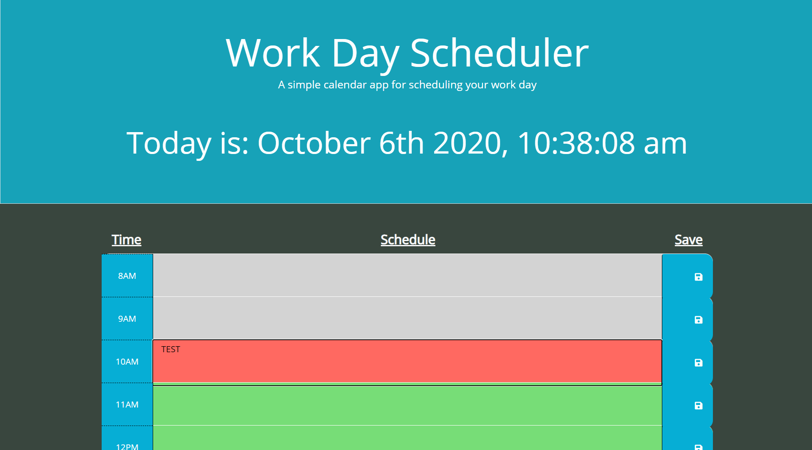

# Work-Day-Scheduler

Started the layout of the planner
Added the Moment JS real-time feature to the jumbotron
Began editing CSS and Bootstrap features for aesthetics

---

Save button feature working
Local storage of user input and recall working via set and get item values

---

Created variables and loop for real-time color changes
Fixed issue of missing "()"s for the "var hour" function
Loop working currently, will check after hours to make sure it works outside of time frame
Changes some CSS for visual aesthetics

---

Everything working properly outside of time blocks and current hour
Changed some CSS with hour display of texts
Added new screenshot of finished page
  
 

